# pixel-artist

A toy API to convert any bitmap image in to RGB colours!

## Demo

View a demo at [https://pixel-artist.herokuapp.com](https://pixel-artist.herokuapp.com)

Or try it with a random unsplash image

[https://pixel-artist.herokuapp.com/api/?cols=32&https://source.unsplash.com/random](https://pixel-artist.herokuapp.com/api/?cols=32&url=https://source.unsplash.com/520x640/?portrait)

## Install & run

```
npm install && node index.js
```

## Usage

Reach the hosted API at

```
https://pixel-artist.herokuapp.com/api/?cols=x&url=y
```

It accepts two parameters, columns: `cols` (min `4` max `64` default `32`); and `url` for any valid bitmap image

Fewer columns, the faster! Returns a multidimensional array and some meta data:

```json
{
   "pixels":[
      [
         "rgb(160, 144, 169)",
         "rgb(130, 114, 137)",
         "rgb(85, 108, 128)",
         "rgb(229, 244, 253)"
      ],
      [
         "rgb(208, 205, 220)",
         "rgb(162, 152, 149)",
         "rgb(150, 158, 173)",
         "rgb(123, 137, 152)"
      ],
      ...
   ],
   "meta":{
      "cols":4,
      "rows":5,
      "title":"Starry Night, Van Gogh"
   }
}
```

## Examples

[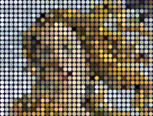](public/screengrabs/demo_1.png)
[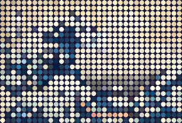](public/screengrabs/demo_3.png)
[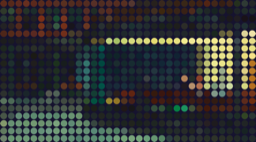](public/screengrabs/demo_4.png)
[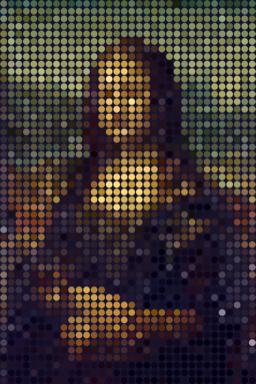](public/screengrabs/demo_2.png)
[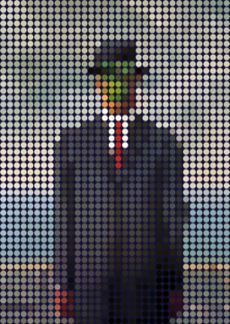](public/screengrabs/demo_6.png)
[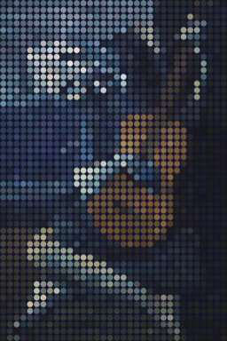](public/screengrabs/demo_7.png)
[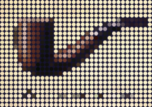](public/screengrabs/demo_5.png)
[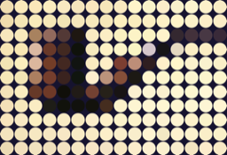](public/screengrabs/demo_9.png)
[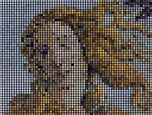](public/screengrabs/demo_10.png)
[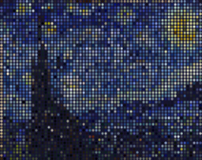](public/screengrabs/demo_11.png)
[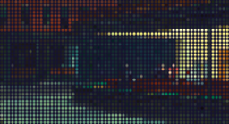](public/screengrabs/demo_12.png)
[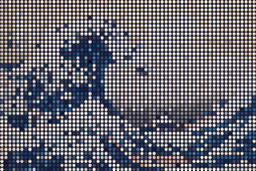](public/screengrabs/demo_13.png)
[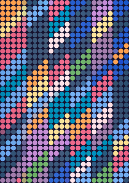](public/screengrabs/demo_14.png)
[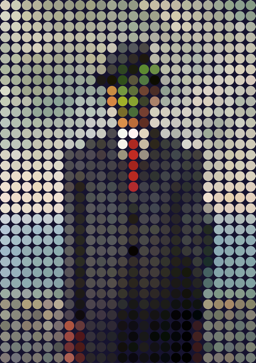](public/screengrabs/demo_15.png)
[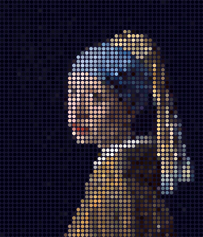](public/screengrabs/demo_16.png)
[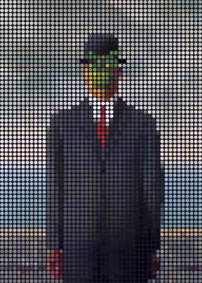](public/screengrabs/demo_17.png)
[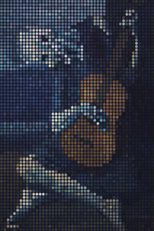](public/screengrabs/demo_18.png)
[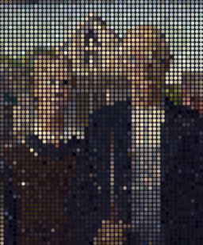](public/screengrabs/demo_19.png)
[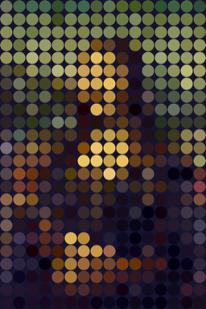](public/screengrabs/demo_20.png)
[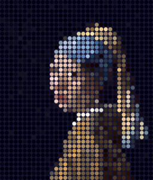](public/screengrabs/demo_21.png)
[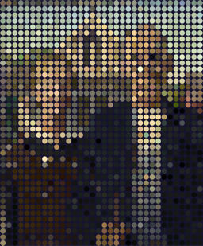](public/screengrabs/demo_22.png)

## License

This project is licensed under the [unlicense](https://unlicense.org/).
