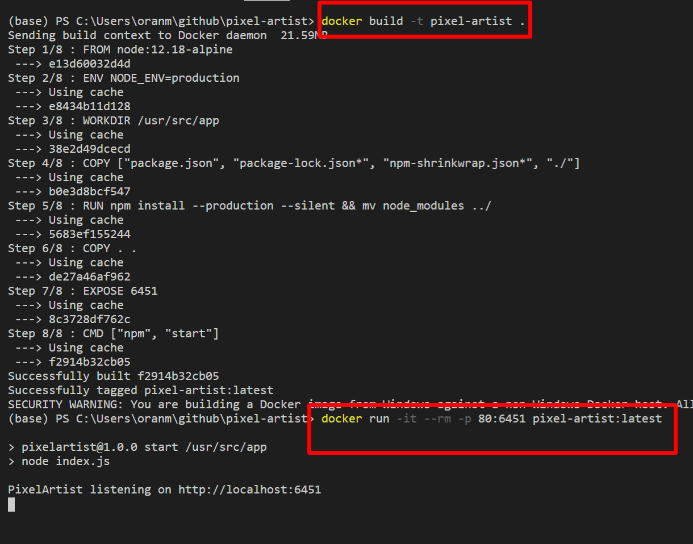

# pixel-artist

### A toy API to convert any bitmap image in to RGB colours!

---

[](https://shields.io/) [](http://unlicense.org/).


## Demo


#### View a demo at [https://pixel-artist.herokuapp.com](https://pixel-artist.herokuapp.com)

#### Or try it with a random unsplash image

##### [https://pixel-artist.herokuapp.com/api/?cols=32&https://source.unsplash.com/random](https://pixel-artist.herokuapp.com/api/?cols=32&url=https://source.unsplash.com/520x640/?portrait)

## Install & run

#### Docker

```bash
docker run -it --rm -p 80:6451 wisehackermonkey/pixel-artist:latest
```

#### Node

```bash
npm install
npm start
```


#### Docker-compose

```
docker-compose up
```


#### Docker Build from scratch

```bash
docker build -t pixel-artist .
docker run -it --rm -p 80:6451 pixel-artist:latest
```



#### Open `localhost:80`


## Usage

Reach the hosted API at

```
https://pixel-artist.herokuapp.com/api/?cols=x&url=y
```

It accepts two parameters, columns: `cols` (min `4` max `64` default `32`); and `url` for any valid bitmap image

Fewer columns, the faster! Returns a multidimensional array and some meta data:

```json
{
   "pixels":[
      [
         "rgb(160, 144, 169)",
         "rgb(130, 114, 137)",
         "rgb(85, 108, 128)",
         "rgb(229, 244, 253)"
      ],
      [
         "rgb(208, 205, 220)",
         "rgb(162, 152, 149)",
         "rgb(150, 158, 173)",
         "rgb(123, 137, 152)"
      ],
      ...
   ],
   "meta":{
      "cols":4,
      "rows":5,
      "title":"Starry Night, Van Gogh"
   }
}
```

## New! SVG API!

Returns an .svg image file.

It accepts the same two parameters as a normal API cal, columns: `cols` (min `4` max `64` default `32`); and `url` for any valid bitmap image

```
https://pixel-artist.herokuapp.com/svg/?cols=x&url=y
```

BUT also:

`size` (dot size, default `12`)

`gap` (gap between the dots, default `2`)

`background` (a background fill that can be any valid css color, rgb,
hex (if you use hex, you need to encode the hash to `%23` e.g.
`%23FFFFFF`) etc. Default is transparent)

`shape` (`'circle'` or `'square'` default `'circle'`)'

```
https://pixel-artist.herokuapp.com/svg/?shape=square&background=%23bada55&gap=10&size=40&url=https://source.unsplash.com/520x640/?portrait&cols=22&
```

[Try it out!](https://pixel-artist.herokuapp.com/svg/?shape=square&background=%23bada55&gap=10&size=40&url=https://source.unsplash.com/520x640/?portrait&cols=42)

BTW! It'd be unwise to hotlink to images on the hosted api as heroku has a 30 second cold start so it'll be super slow to load!

## Examples

|                                                                                     |                                                                                     |                                                                                     |
| ----------------------------------------------------------------------------------- | ----------------------------------------------------------------------------------- | ----------------------------------------------------------------------------------- |
| [](public/screengrabs/demo_1.png)    | [](public/screengrabs/demo_3.png)    | [](public/screengrabs/demo_4.png)    |
|                                                                                     |
| [](public/screengrabs/demo_2.png)    | [](public/screengrabs/demo_6.png)    | [](public/screengrabs/demo_7.png)    |
| [](public/screengrabs/demo_5.png)    | [](public/screengrabs/demo_9.png)    | [](public/screengrabs/demo_10.png) |
| [](public/screengrabs/demo_11.png) | [](public/screengrabs/demo_12.png) | [](public/screengrabs/demo_13.png) |
| [](public/screengrabs/demo_14.png) | [](public/screengrabs/demo_15.png) | [](public/screengrabs/demo_16.png) |
| [](public/screengrabs/demo_17.png) | [](public/screengrabs/demo_18.png) | [](public/screengrabs/demo_19.png) |
| [](public/screengrabs/demo_20.png) | [](public/screengrabs/demo_21.png) | [](public/screengrabs/demo_22.png) |

# Development

### how to publish docker image to docker hub

```bash
git clone https://github.com/blackspike/pixel-artist.git

cd pixel-artist

docker build . -t wisehackermonkey/pixel-artist:latest

docker login

docker push wisehackermonkey/pixel-artist:latest
```

# Contributors

<a href="https://github.com/blackspike/pixel-artist/graphs/contributors">
  
</a>

Made with [contributors-img](https://contrib.rocks).

## License

#### This project is licensed under the [](http://unlicense.org/).
